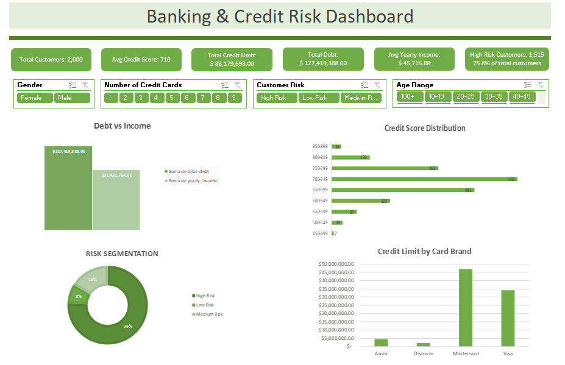

# 💳 Banking & Credit Risk Dashboard

<p align="center">
  
</p>

<p align="center">
  
  
  
</p>

---

# 🇧🇷 Português

## 🎯 Objetivo

Dashboard interativo desenvolvido no Microsoft Excel para análise de clientes bancários, limite de crédito, endividamento e segmentação de risco.

O projeto foi criado com foco em análise financeira, visualização de dados e enriquecimento de datasets através da criação de colunas derivadas e KPIs dinâmicos.

---

# 📈 KPIs Desenvolvidos

- 👥 Total de Clientes
- 💳 Score Médio de Crédito
- 💰 Limite Total de Crédito
- 📉 Dívida Total dos Clientes
- 💵 Média de Renda Anual
- ⚠️ Total de Clientes de Alto Risco

---

# 📊 Funcionalidades do Dashboard

## 🔹 Filtros Interativos
- Gênero
- Número de Cartões
- Nível de Risco
- Faixa Etária

## 🔹 Visualizações
- Comparação entre dívida e renda
- Distribuição de score de crédito
- Segmentação de risco
- Limite de crédito por bandeira

---

# 🧠 Engenharia e Transformação de Dados

O projeto incluiu criação e tratamento de novas colunas no dataset de clientes para enriquecer as análises financeiras.

## 🔹 Colunas Criadas

### 📌 Faixa de Score (`score_range`)
Segmentação automática dos clientes por faixa de score de crédito.

Exemplo:
- 450-499
- 500-549
- 700-749
- 800-849

### 📌 Faixa Etária (`age_range`)
Classificação dos clientes em grupos etários.

Exemplo:
- 10-19
- 20-29
- 30-39
- 40-49

### 📌 Classificação de Risco (`customer_risk`)
Definição automática do nível de risco baseado em score e relação dívida/renda.

Exemplo:
- High Risk
- Medium Risk
- Low Risk

### 📌 Debt Income Ratio (`debt_income_ratio`)
Cálculo percentual entre dívida total e renda anual.

---

# 🛠 Habilidades Demonstradas

- Dashboards Interativos
- Análise Financeira
- Análise de Crédito
- Business Intelligence
- Tratamento de Dados
- Engenharia de Dados em Excel
- Criação de KPIs
- Segmentação de Clientes
- Visualização de Dados
- Modelagem de Dados
- Fórmulas Avançadas
- Tabelas Dinâmicas
- Segmentação de Dados

---

# ⚙️ Fórmulas e Técnicas Utilizadas

## 🔹 Fórmulas
- `SE`
- `SES`
- `CONT.SE`
- `SOMASES`
- `MÉDIA`
- `ARRED`
- `CONCAT`

## 🔹 Técnicas
- Criação de colunas derivadas
- Classificação dinâmica de risco
- Agrupamento por faixa etária
- Segmentação por score de crédito
- Relacionamento entre datasets
- Modelagem analítica

---

# ⚙️ Ferramentas Utilizadas

- Microsoft Excel
- Pivot Tables
- Pivot Charts
- Slicers
- Conditional Formatting
- Advanced Excel Formulas

---

# 📂 Dataset

O projeto utiliza múltiplos datasets relacionados ao setor bancário, contendo informações como:
- Clientes
- Cartões bancários
- Score de crédito
- Renda anual
- Dívidas
- Limites de crédito
- Bandeiras de cartão
- Dados cadastrais

---

# 🇺🇸 English

## 🎯 Objective

Interactive dashboard developed in Microsoft Excel for banking customer analysis, credit limits, debt monitoring and customer risk segmentation.

This project was built focusing on financial analytics, data visualization and dataset enrichment through derived columns and dynamic KPI creation.

---

# 📈 Developed KPIs

- 👥 Total Customers
- 💳 Average Credit Score
- 💰 Total Credit Limit
- 📉 Total Customer Debt
- 💵 Average Yearly Income
- ⚠️ Total High Risk Customers

---

# 📊 Dashboard Features

## 🔹 Interactive Filters
- Gender
- Number of Credit Cards
- Customer Risk
- Age Range

## 🔹 Visualizations
- Debt vs Income comparison
- Credit score distribution
- Risk segmentation
- Credit limit by card brand

---

# 🧠 Data Engineering & Transformation

The project included creation and transformation of new dataset columns to improve financial analysis and customer segmentation.

## 🔹 Created Columns

### 📌 Score Range (`score_range`)
Automatic segmentation based on customer credit score.

Example:
- 450-499
- 500-549
- 700-749
- 800-849

### 📌 Age Range (`age_range`)
Customer age group classification.

Example:
- 10-19
- 20-29
- 30-39
- 40-49

### 📌 Customer Risk (`customer_risk`)
Automatic customer risk classification based on score and debt-income ratio.

Example:
- High Risk
- Medium Risk
- Low Risk

### 📌 Debt Income Ratio (`debt_income_ratio`)
Percentage calculation between total debt and yearly income.

---

# 🛠 Skills Demonstrated

- Interactive Dashboards
- Financial Analysis
- Credit Risk Analysis
- Business Intelligence
- Data Transformation
- Data Engineering in Excel
- KPI Development
- Customer Segmentation
- Data Visualization
- Data Modeling
- Advanced Formulas
- Pivot Tables
- Data Slicers

---

# ⚙️ Formulas & Techniques Used

## 🔹 Formulas
- `IF`
- `IFS`
- `COUNTIF`
- `SUMIFS`
- `AVERAGE`
- `ROUND`
- `CONCAT`

## 🔹 Techniques
- Derived column creation
- Dynamic risk classification
- Age group segmentation
- Credit score grouping
- Dataset relationship handling
- Analytical modeling

---

# ⚙️ Tools Used

- Microsoft Excel
- Pivot Tables
- Pivot Charts
- Slicers
- Conditional Formatting
- Advanced Excel Formulas

---

# 📂 Dataset

This project uses multiple banking-related datasets containing information such as:
- Customers
- Banking cards
- Credit score
- Yearly income
- Debts
- Credit limits
- Card brands
- Customer information

---

# 🚀 Future Improvements

- Power Query automation
- Power Pivot relationships
- Predictive risk analysis
- Customer default forecasting
- Financial trend analysis
- Advanced banking KPIs

---

## 👨‍💻 Author

### Marcelo Pereira

[](https://linkedin.com/in/www.linkedin.com/in/marcelo-pereira-a4055b287)
[](https://github.com/MarjoDev)
```
